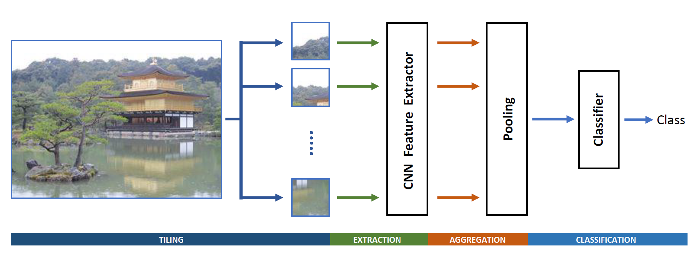

# E2E-ForgeryDetection
Code for "A Full-Image Full-Resolution End-to-End-Trainable CNN Framework for Image Forgery Detection"
The paper can be found on [arxiv](https://arxiv.org/abs/1909.06751).



## Pretrained weights
Download the model weights in ./model/E2E folder from [here](http://www.grip.unina.it/index.php?option=com_content&view=article&id=79&Itemid=489&jsmallfib=1&dir=JSROOT/E2E)

## Test
To run the code on given test dataset, type:
```
python test.py -m=FUSION
```
This will run the fusion of the three models proposed in the paper (E2E-FUSION) on images in ./test/ directory.  
For running on a single modality, change 'mode' parameter: 'RGB'-'N'-'RGN'

## Test on Your Dataset
To run the code on your own dataset, type:
```
python test.py --te=PATH_TO_YOUR_DATASET
```
Where PATH_TO_YOUR_DATASET is organized with two subfolder: '0' contains pristine images and '1' contains forged images.  
Modify the test.py file according to your needs.  

For any problem or comment, do not hesitate to contact me.

## Citation
```
@misc{marra2019e2e,
    title={A Full-Image Full-Resolution End-to-End-Trainable CNN Framework for Image Forgery Detection},
    author={Francesco Marra, Diego Gragnaniello, Luisa Verdoliva, Giovanni Poggi},
    year={2019},
    eprint={1909.06751},
    archivePrefix={arXiv},
    primaryClass={cs.CV}
}
```

## License
Copyright (c) 2019 Image Processing Research Group of University Federico II of Naples ('GRIP-UNINA').

All rights reserved.

This software should be used, reproduced and modified only for informational and nonprofit purposes.

By downloading and/or using any of these files, you implicitly agree to all the
terms of the license, as specified in the document LICENSE.txt
(included in this package) 
